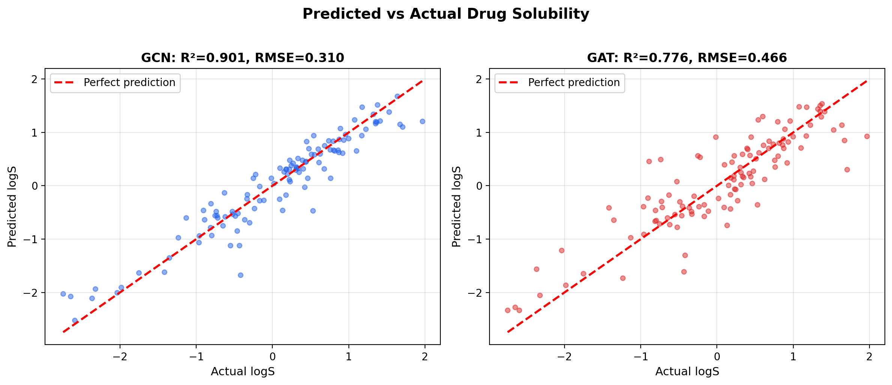
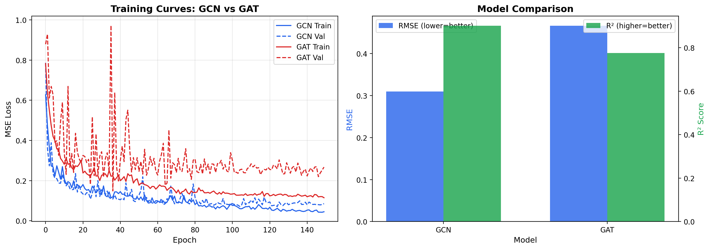
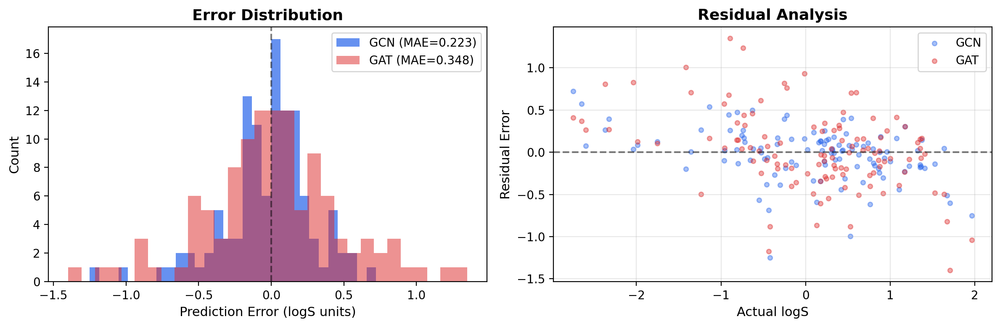
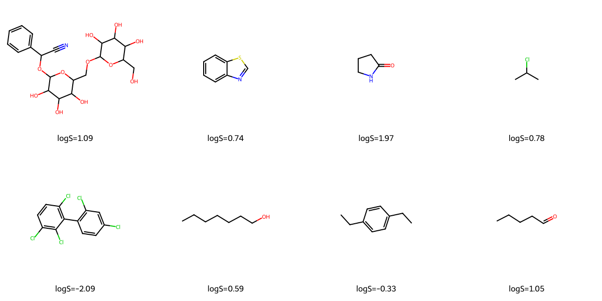
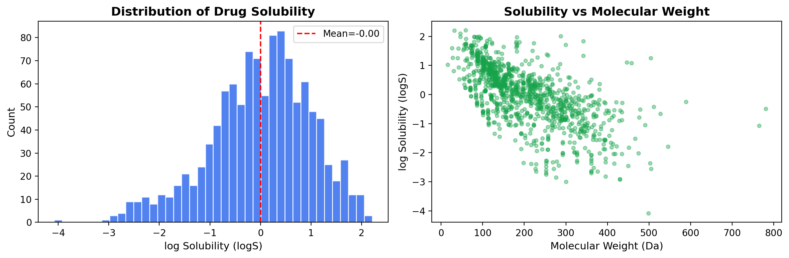

# GNN for Drug Solubility Prediction

Predicting water solubility (logS) of drug molecules directly from their molecular graph structure using Graph Neural Networks. This is how pharma companies like Schrödinger predict ADMET properties in early drug discovery.

## What this project does

Molecules are graphs — atoms are nodes, bonds are edges. Instead of manually computing fingerprints, we let Graph Neural Networks learn the representation directly from the molecular structure.

I built and compared two GNN architectures:
- **GCN** (Graph Convolutional Network) — aggregates neighbor features equally
- **GAT** (Graph Attention Network) — uses attention to weigh which neighbors matter more

Both models predict log solubility from the 2D molecular graph. Solubility is one of the most important ADMET properties — if a drug isn't soluble, it can't be absorbed.

## Dataset

ESOL (Estimated SOLubility) from MoleculeNet — 1,128 real drug-like molecules with experimentally measured water solubility values. This is a standard benchmark in molecular ML.

## Architecture

```
Molecule (SMILES) → RDKit → Molecular Graph
  ↓
Atom features (10 per atom): atomic num, degree, charge, 
  hybridization, aromaticity, H count, ring membership, etc.
  ↓
GCN/GAT layers (3 layers with skip connections + BatchNorm)
  ↓
Global pooling (mean + max concatenated)
  ↓
FC layers → logS prediction
```

# GNN for Drug Solubility Prediction

Predicting water solubility (logS) of drug molecules from their molecular graph structure using Graph Neural Networks. This is how pharma companies like Schrödinger predict ADMET properties early in drug discovery.

## Results

| Model | RMSE | MAE | R² |
|-------|------|-----|-----|
| **GCN** | **0.3096** | **0.2229** | **0.9012** |
| GAT | 0.4663 | 0.3477 | 0.7758 |

GCN achieved **R² = 0.90** on the ESOL benchmark — comparable to published state-of-the-art for this dataset size. GCN outperformed GAT here, which is common for small molecular datasets where attention mechanisms can overfit.

## What this project does

Molecules are graphs — atoms are nodes, bonds are edges. Instead of computing fingerprints by hand, I let Graph Neural Networks learn the representation directly from molecular structure.

I built and compared two GNN architectures:
- **GCN** (Graph Convolutional Network) — aggregates neighbor features equally
- **GAT** (Graph Attention Network) — uses attention to weigh neighbors

Both predict log solubility from 2D molecular graphs. Solubility is a key ADMET property — if a drug isn't soluble, it can't be absorbed.

## Dataset

ESOL (Estimated SOLubility) from MoleculeNet — 1,128 real drug-like molecules with experimentally measured water solubility. Standard benchmark in molecular ML.

## Architecture

### Predicted vs Actual


### Training Curves


### Error Analysis


### Sample Molecules


### Data Distribution


## What makes this different from my ESM-2 project

My previous project (protein localization) used sequence embeddings + a feedforward network. This project treats molecules as graphs and uses graph convolutions — a fundamentally different approach that captures molecular topology. GNNs are the current standard for molecular property prediction in industry.

## What I learned

- How to convert SMILES → molecular graphs using RDKit + PyTorch Geometric
- Difference between GCN (equal aggregation) and GAT (attention-weighted aggregation)
- Global pooling strategies for graph-level prediction (mean + max pooling)
- Why solubility prediction matters in drug discovery (ADMET pipeline)
- Graph neural networks capture molecular structure better than fingerprint-based methods for some tasks

## How to run

Google Colab (GPU recommended):

```bash
pip install torch torch-geometric rdkit-pypi deepchem matplotlib seaborn scikit-learn
```

## Tools

Python, PyTorch, PyTorch Geometric, RDKit, DeepChem, scikit-learn, matplotlib

## References

- Wu et al. (2018). MoleculeNet: a benchmark for molecular machine learning. Chemical Science.
- Kipf & Welling (2017). Semi-Supervised Classification with Graph Convolutional Networks. ICLR.
- Veličković et al. (2018). Graph Attention Networks. ICLR.

---
Pradip Palekar | MT25215 | M.Tech Computational Biology, IIIT Delhi
pradip25215@iiitd.ac.in
